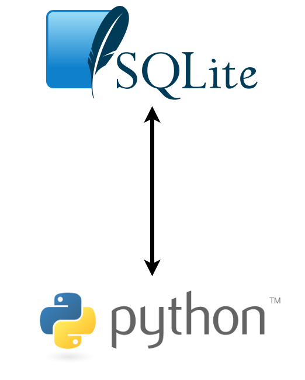

Authors: *[Yannik Suhre](https://github.com/Estreuselito), [Jan Faulstich](https://github.com/TazTornadoo), [Diego Caceres](https://github.com/diegocaceresm), [Sebastian Sydow](https://gitlab.com/sydow), [Hsi Wei Wang](https://gitlab.com/wey153), [Krzysztof Trebicki](https://github.com/KrzysztofTrebicki), [Niklas Zipf](https://github.com/niklaszipf)*

# Buffetis <!-- omit in toc -->
 > 🚀 This repository looks into how Warren Buffet made his investments.




*The references for the logos used in this picture can be found on the bottom of this README.*

In general this repository has two different kinds of scripts. Once the [Project steps](#Project-steps) and second the [Helper Scripts](#helper-scripts). The prior contains scripts which are named like ```[number]_pipeline_[function].py```. These are the _real meat_ of this project, since they do all the real work. The latter, the [Helper scripts](#helper-scrips), are support those pipeline script, since they mostly contain user written functions.

# Table of contents <!-- omit in toc -->
- [How to get You started!](#how-to-get-you-started)
- [Project steps](#project-steps)
  - [```0_pipeline_data_input.py```](#0_pipeline_data_inputpy)
- [Helper Scripts](#helper-scripts)
  - [```data_storage.py```](#data_storagepy)
- [References](#references)

# How to get You started!
> 🏗️ This short paragraph is getting you started!

Within this project, we will be leveraging the idea of Docker and its Containers. More specifically we use the so called "devcontainer" in VS Code. An extensive explanation of how you can set this up, can be found [here](https://21stcenturyscholars.org/?p=80).

# Project steps
> 🧬 This paragraph outlines what the single scripts doing

In total this project has ... scripts in total.

## ```0_pipeline_data_input.py```
> 🎤 This script downloads and inputs the data into a database

This script contains a function and a function statement
which automatically creates the connection to the database
Buffet or creates it, if it is not existant in the folder
database.

# Helper Scripts
> ⛑️ These kind of scripts are used to help provided user written functions

In total this project has ... helper scripts. Those scripts are listed hereafter. In general the idea of creating such scripts was to create a place where user defined functions could be stored. 

## ```data_storage.py```
> 🧳 Explains what the file ```data_storage.py``` does

Within this file is a function stored, which creates the connection to the database. If the database and respectively its' folder does not exist yet (e.g. running it for the first time) those will be create. Specifically the folder ```database``` will be created and in it the database named ```Buffet.db```. This is a SQL database, which can be access either over Python or over normal tools like DBeaver.

# References

[1] https://commons.wikimedia.org/wiki/File:SQLite370.svg

[2] https://www.python.org/community/logos/
