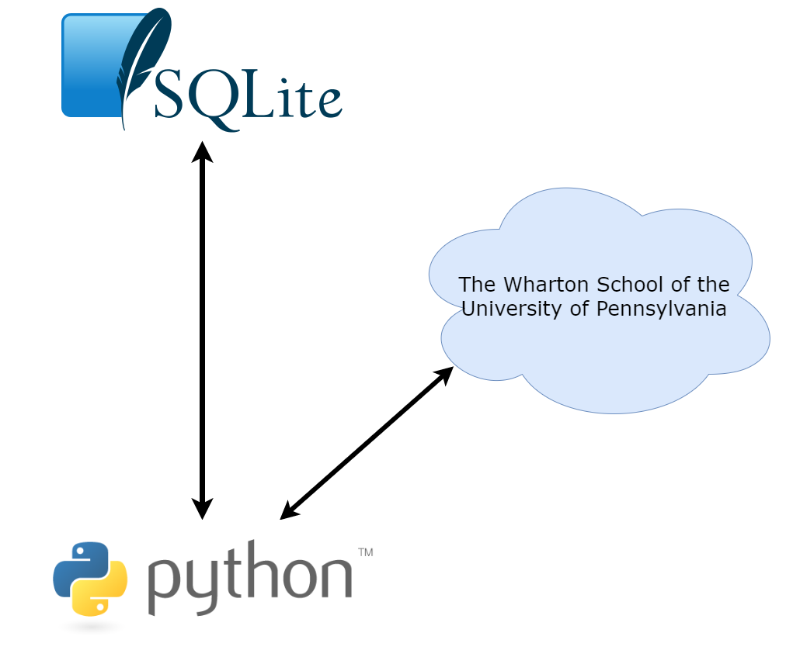

Authors: *[Yannik Suhre](https://github.com/Estreuselito), [Jan Faulstich](https://github.com/TazTornadoo), [Diego Caceres](https://github.com/diegocaceresm), [Sebastian Sydow](https://gitlab.com/sydow), [Hsi Wei Wang](https://gitlab.com/wey153), [Krzysztof Trebicki](https://github.com/KrzysztofTrebicki), [Niklas Zipf](https://github.com/niklaszipf)*

# Buffetis <!-- omit in toc -->
 > 🚀 This repository looks into how Warren Buffet made his investments.




*The references for the logos used in this picture can be found on the bottom of this README.*

In general this repository has two different kinds of scripts. Once the [Project steps](#Project-steps) and second the [Helper Scripts](#helper-scripts). The prior contains scripts which are named like ```[number]_pipeline_[function].py```. These are the _real meat_ of this project, since they do all the real work. The latter, the [Helper scripts](#helper-scrips), are support those pipeline script, since they mostly contain user written functions.

# Table of contents <!-- omit in toc -->
- [How to get You started!](#how-to-get-you-started)
- [Project steps](#project-steps)
  - [```0_pipeline_data_input.py```](#0_pipeline_data_inputpy)
  - [```1_pipeline_calc_ratios.py```](#1_pipeline_calc_ratiospy)
  - [```2_stock_matcher.py```](#2_stock_matcherpy)
  - [```3_premium_matcher.py```](#3_premium_matcherpy)
  - [```4_premium_dummies.py```](#4_premium_dummiespy)
- [Helper Scripts](#helper-scripts)
  - [```data_storage.py```](#data_storagepy)
  - [```financial_ratios.py```](#financial_ratiospy)
  - [```receiving_sec_data.py```](#receiving_sec_datapy)
  - [```get_cusips.py```](#get_cusipspy)
  - [```cusips_2_company_name.py```](#cusips_2_company_namepy)
- [References](#references)

# How to get You started!
> 🏗️ This short paragraph is getting you started!

Within this project, we will be leveraging the idea of Docker and its Containers. More specifically we use the so called "devcontainer" in VS Code. An extensive explanation of how you can set this up, can be found [here](https://21stcenturyscholars.org/?p=80).

# Project steps
> 🧬 This paragraph outlines what the single scripts doing

In total this project has ... scripts in total.

## ```0_pipeline_data_input.py```
> 🎤 This script downloads and inputs the data into a database

This script contains a function and a function statement
which automatically creates the connection to the database
Buffet or creates it, if it is not existant in the folder
database. Furthermore it loads the data into the database.
Please be aware that we were **NOT** able to share our data,
since this is paid data. Please be adviced to either contact
us directly or use the script [```receiving_sec_data.py```](#receiving_sec_datapy).
Furthermore, you need to have a [```Wharton``` Account](https://wrds-www.wharton.upenn.edu/login/).


## ```1_pipeline_calc_ratios.py```
> 🧮 Within this script several finacial indicators are calculated

This script firstly queries data from the SQLite database, which 
was created in the first script. Then it initialized the class 
```Financial_ratios```, which will be discussed in the section
[```financial_ratios.py```](#finacial_ratiospy). It then creates
a ```pandas``` dataframe, where all the different ratios are stored
in. In the end this is written back to SQLite database.

## ```2_stock_matcher.py```
> 📈 This script calculates the final data for analysis

This script first gets the initial investments for Berkshire Hathaway.
This is necessary in order to find benchmark companies later on. It then
reads the necessary data from Wharton which is by then saved in the database
and calculates the given metrics for the previous years. In order to make
proper analysis later on, this script ensures to drop all observations
which have missing values in the selected columns. It the finds
benchmark companies for each investment company Berkshire Hathaway made.
This is done by selecting a company which has the same first two
SIC Code numbers in the same year and has the closest difference in terms
of the total asset to the investment company. Lastly, all the gather information
is joined onto a dataframe which only contains the initial investments and their
respective benchmark companies.

## ```3_premium_matcher.py```
> This script matches the event of Buffett investing in a company with the time series of each stock

This script first gets the year and the month out of the date column for both sources, 
the SEC filings and the stock data. We need to do this step to join both data sources based on the cusip,
year and the month to identify the exact moment Warren Buffett invested into a stock. After we joined both data sources 
we mark the previously described event with a 1 for the initial investment time in the columns cusip2.
After executing the code successfully the current tables is loaded into our database.

## ```4_premium_dummies.py```
> This script ranks the months based on the column cusip2, which is indicating an initial investment

This script loads the data merged in ```3_premium_matcher.py``` into a dataframe in a first step.
Afterwards we define the target dataframe in which we load the end result of our code. 
The main idea of this code is to rank the months for each cusip. The month, which is the initial event, is ranked as a zero. 
All months of the time series before and after that event are incrementally decreasing and increasing depending on whether the data
is before or after the event t0. Additionally, we also define the dummy variable in this script to do a regression based on the return and
the dummy variable. The dummy variable is encoded so all months before the event have a 0 as value and all months after the event and including
the event are encoded by a 1. Once the script is done running it outputs a csv file which you can upload in your excel sheet to build
a regression based on it.

# Helper Scripts
> ⛑️ These kind of scripts are used to help provided user written functions

In total this project has ... helper scripts. Those scripts are listed hereafter. In general the idea of creating such scripts was to create a place where user defined functions could be stored. 

## ```data_storage.py```
> 🧳 Explains what the file ```data_storage.py``` does

Within this file is a function stored, which creates the connection to the database. If the database and respectively its' folder does not exist yet (e.g. running it for the first time) those will be create. Specifically the folder ```database``` will be created and in it the database named ```Buffet.db```. This is a SQL database, which can be access either over Python or over normal tools like DBeaver.

## ```financial_ratios.py```
> 🖩 This section explains what the respective file does

Within this script a class, which is named ```Financial_ratios```.
This class contains several functions, which calculate different
ratios, To see what functions there are and what they refer to,
please see their docstring, since they are pretty well documented.
In the end, this class  not leveraged in the script [```1_pipeline_calc_ratios.py```](#1_pipeline_calc_ratiospy). 
Instead there is also another function called ```compute_financial_ratios```
which in the end was used for calculating the information.

## ```receiving_sec_data.py```
> 🗄️ This is a script, which can crawl the EDGAR database and retrieve the files

Within this script, we were able to crawl the EDGAR database (for the 13HR-F filings
from Berkshire Hathaway). It almost works, the only bug is, that the year sometimes
is one row to high or to low. If this is fixed, this script can be used with slight
modifications for other SEC-filings and companies.

## ```get_cusips.py```
> This script is used to get the distinct cusips out of the SEC filings

By using this helper script we retrieve all cusips from the SEC filings we loaded into our database first.
Based on these retrieved cusips we filter the data we want to load from Wharton and limit the execution time as well 
as saving storage. 

## ```cusips_2_company_name.py```
> This script matches each cusip with the correct company name

This helper script is used to load cusip and company_name out of our database.

# References

[1] https://commons.wikimedia.org/wiki/File:SQLite370.svg

[2] https://www.python.org/community/logos/
